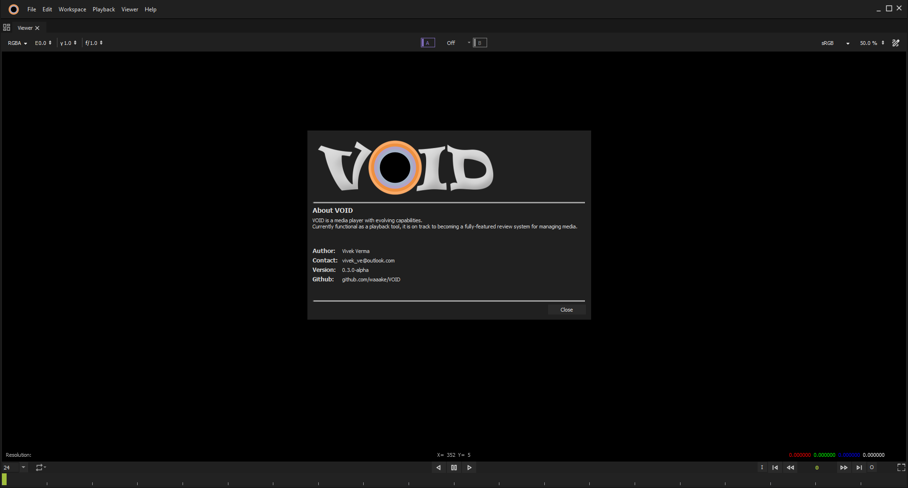
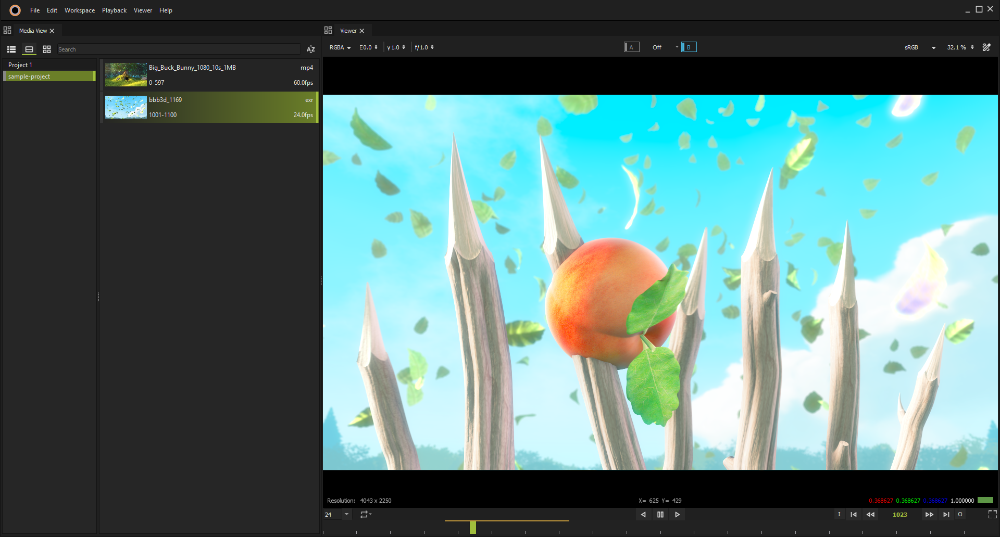

# 
VOID is a player, a growing review system.

This project is a media player designed for playback and management of media files.
As development progresses, it aims to evolve into a full-fledged review system, allowing users to view, analyze media content, provide feedback and add comments.

Below are a few screenshots of its early look.

At its current stage, the player supports basic functionality, such as directory drag-and-drop for playlist management and structured media presentation. 

