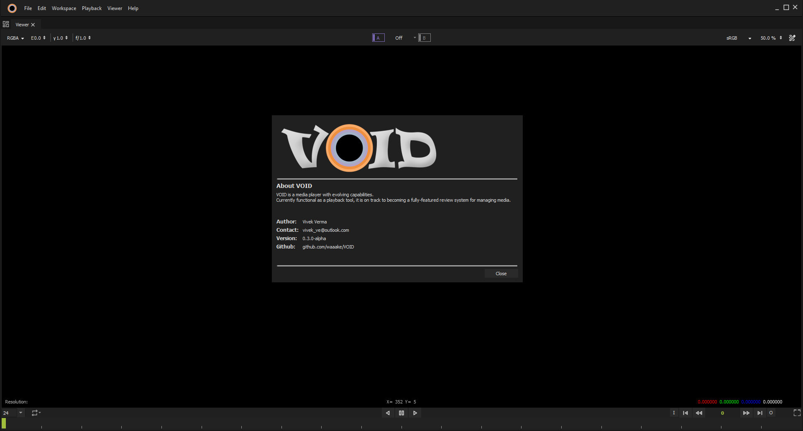

# 
VOID is a player, a growing review system.

This project is a media player designed for playback and management of visual media files.
As development progresses, it aims to evolve into a full-fledged **review system**—enabling users to view, analyze, annotate, and provide feedback on media content.

The player is cross-platform and currently supports **Linux**, **Windows**, and **macOS**. Ongoing development will continue to target all major platforms.

---

## Dive into the [full overview](docs/Overview.md) to see features and more!

## See what's new in the [changelog](CHANGELOG.md).

A peek at the highlights of the latest release:

**0.3.0-alpha**
- Added support for Audio playback.
- Added support for switching between pre-defined workspaces.
- Improved color schemes for the player.
- Added startup window to for quick access/selection of recent projects.

## What's coming next?

Exciting features planned for upcoming development:

- Support for Annotation export.
- Stereoscopic playback support with anaglyph mode.
- Movie timeline in a Timeline sequence UI.
- Quick Grading and Transformation tools.
