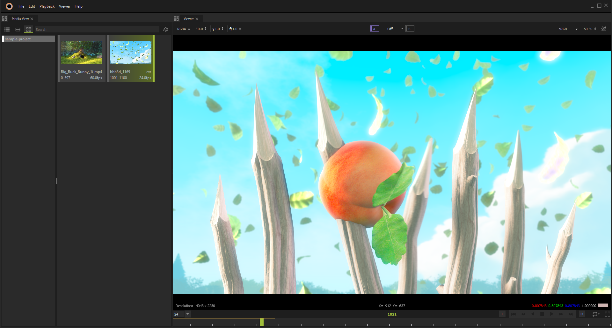
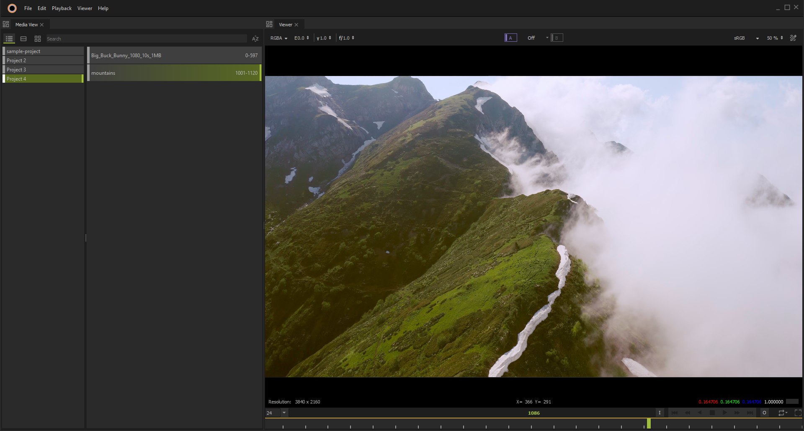
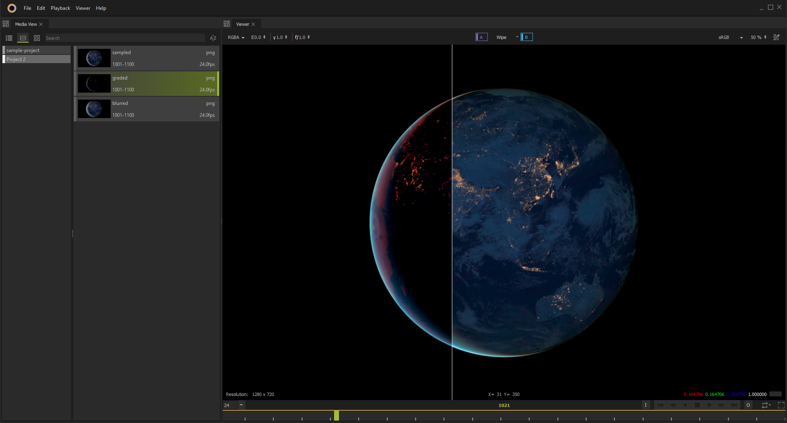
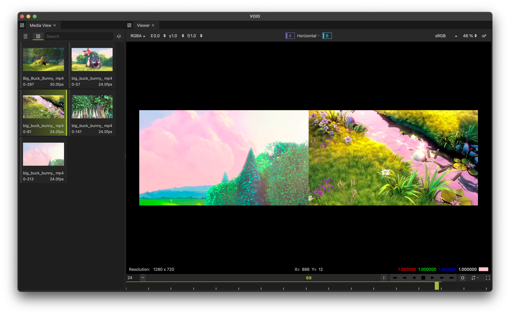
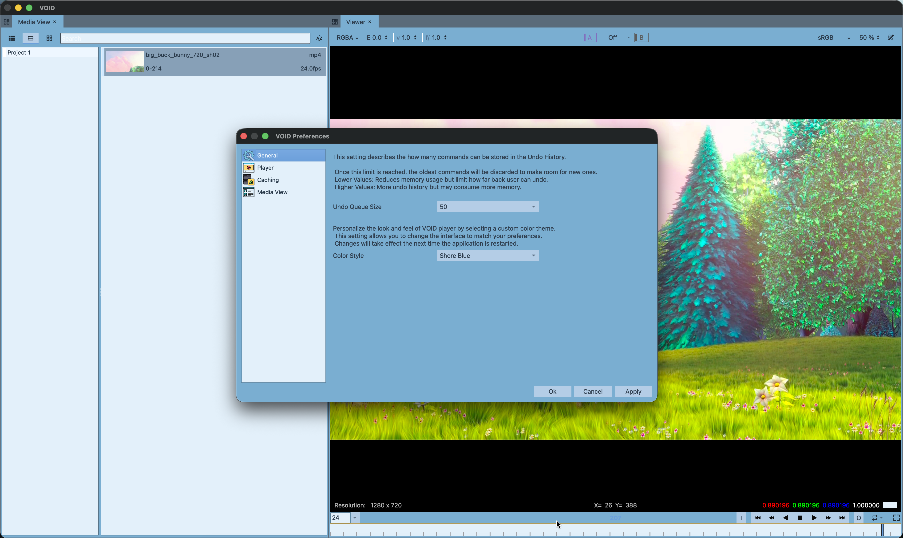

# 
VOID is a player, a growing review system.

This project is a media player designed for playback and management of visual media files.
As development progresses, it aims to evolve into a full-fledged **review system**—enabling users to view, analyze, annotate, and provide feedback on media content.

The player is cross-platform and currently supports **Linux**, **Windows**, and **macOS**. Ongoing development will continue to target all major platforms.

Below are a few screenshots showcasing its early interface and capabilities.

---

## Playlist & Media Organization

- Drag-and-drop support for directories
- Automatically builds structured playlists from media folders

---

## Media Playback

Supports a wide range of media formats:

- **Images**: PNG, EXR, JPG, TIFF, DPX, and couple more via **OpenImageIO**
- **Videos**: MOV and MP4—enabled via **FFmpeg**

The player also supports **media reader plugins**, allowing developers to extend format support by writing custom plugins.
 *An example plugin is available [here](https://github.com/waaake/VOID-Exr-plugin)*

---

## Playback Features

- Standard playback controls: Play, Pause, Seek, etc.
- **Dual-buffer playback**: A/B buffers for simultaneous media handling

---

## Comparison Tools

Dual-buffer mode enables rich media comparison using multiple viewer layouts:

- **Horizontal & Vertical Split**
- **Swipe Compare**
- **Stack Compare**

> *Blend modes are currently under development.*

---

## Annotation Support

- Add annotations directly on media for review and feedback
- Useful for collaborative workflows and visual notes

> *Annotation export is not yet implemented. Exporting annotated frames will be supported once the media writer system is integrated.*

---

## Configuration Options

Customize player behavior with basic preferences:

- Default media view interface
- Handling of missing frames
- Undo history settings

---

## Credits & Licensing Notice

Screenshots used in this project feature content from the open movie **Big Buck Bunny**, created by the [Blender Foundation](https://www.blender.org/).
This content is licensed under the [Creative Commons Attribution 3.0 license](https://creativecommons.org/licenses/by/3.0/).

> © Blender Foundation | [www.bigbuckbunny.org](https://peach.blender.org/)
