# 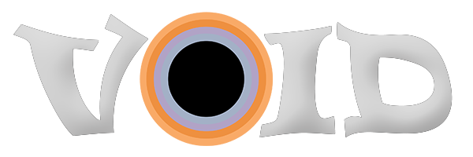

### A quick overview of VOID's interface and capabilities.
---

## Project & Media Organization

- Multi project support for Media
- Drag-and-drop support for directories
- Automatically builds structured playlists from media folders
- In-project multi playlist support for further grouping media for quick review & playback

[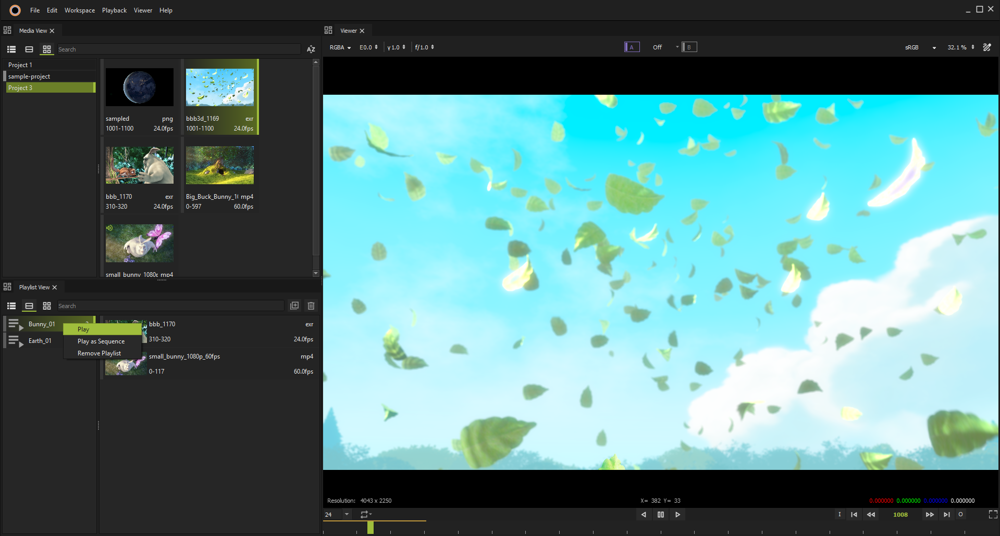](../images/VoidPlaylist.png)

---

## Media Playback

Supports a wide range of media formats:

- **Images**: PNG, EXR, JPG, TIFF, DPX, and couple more via **OpenImageIO**
- **Videos**: MOV and MP4—enabled via **FFmpeg** with audio play support.

The player also supports **media reader plugins**, allowing developers to extend format support by writing custom plugins.
 *An example plugin is available [here](https://github.com/waaake/VOID-Exr-plugin)*

[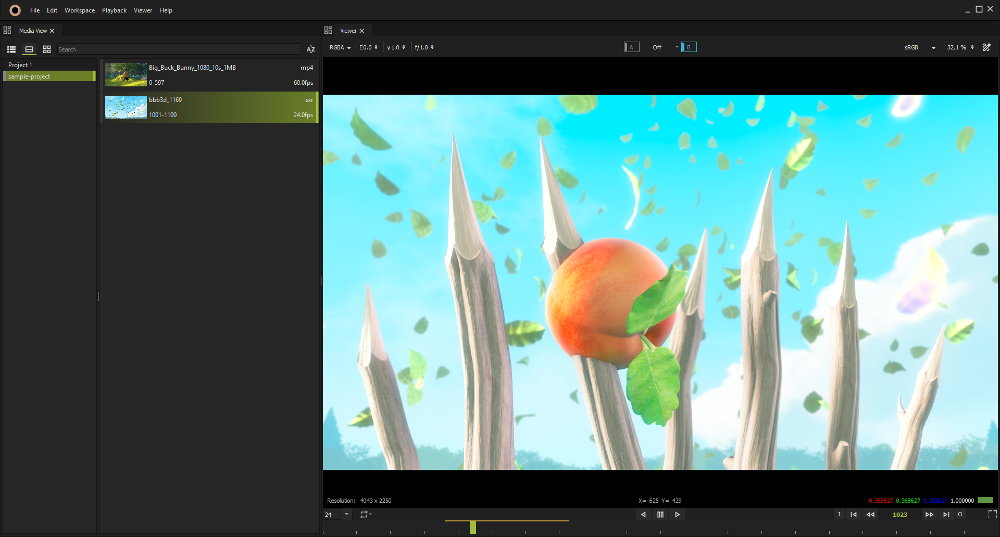](../images/VoidPlayerBasic.png)

---

## Playback Features

- Standard playback controls: Play, Pause, Seek, etc.
- **Dual-buffer playback**: A/B buffers for simultaneous media handling

[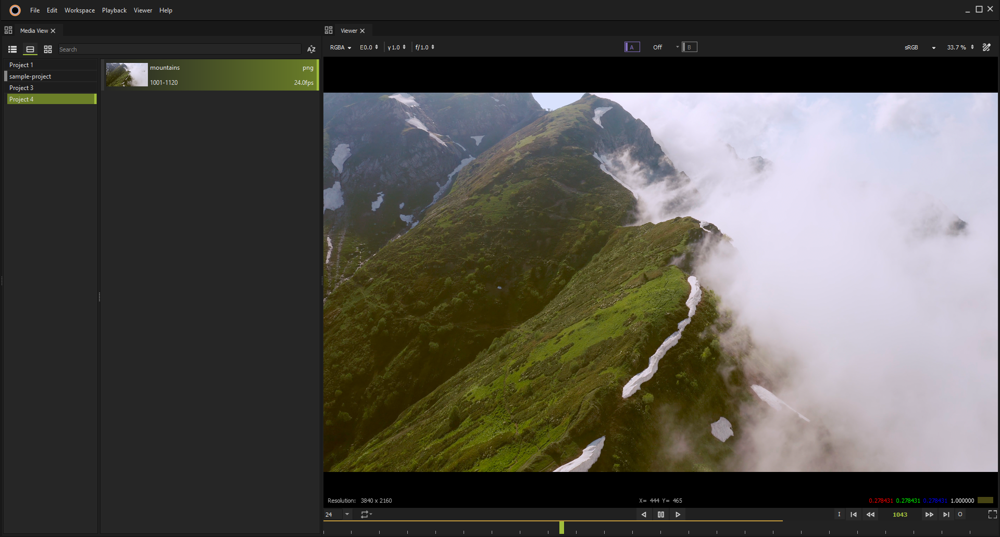](../images/VoidPlayerPlaying.png)

[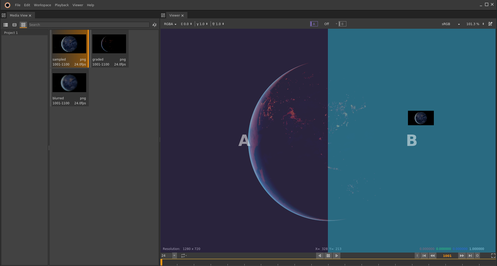](../images/VoidMultiBuffer.png)

[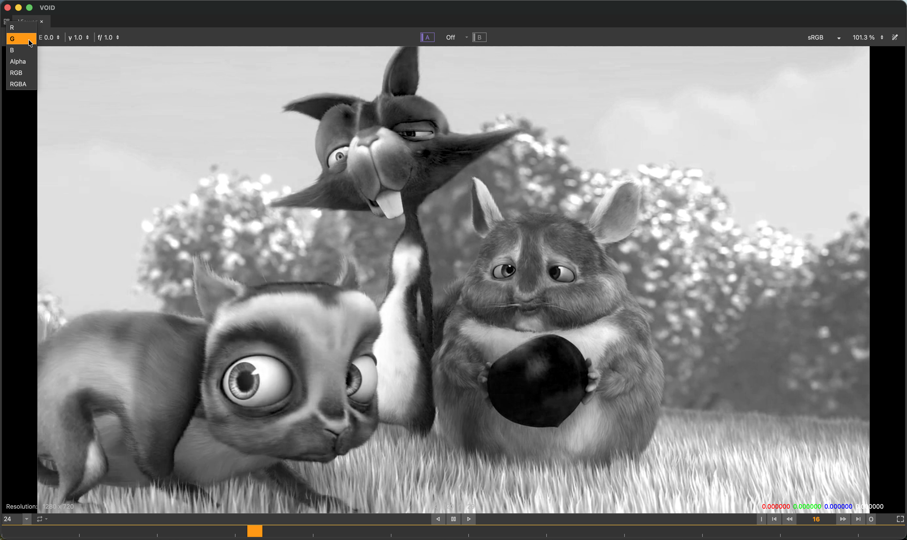](../images/VoidChannelSupport.png)

---

## Comparison Tools

Dual-buffer mode enables rich media comparison using multiple viewer layouts:

- **Horizontal & Vertical Split**
- **Swipe Compare**
- **Stack Compare**

> *Blend modes are currently under development.*

[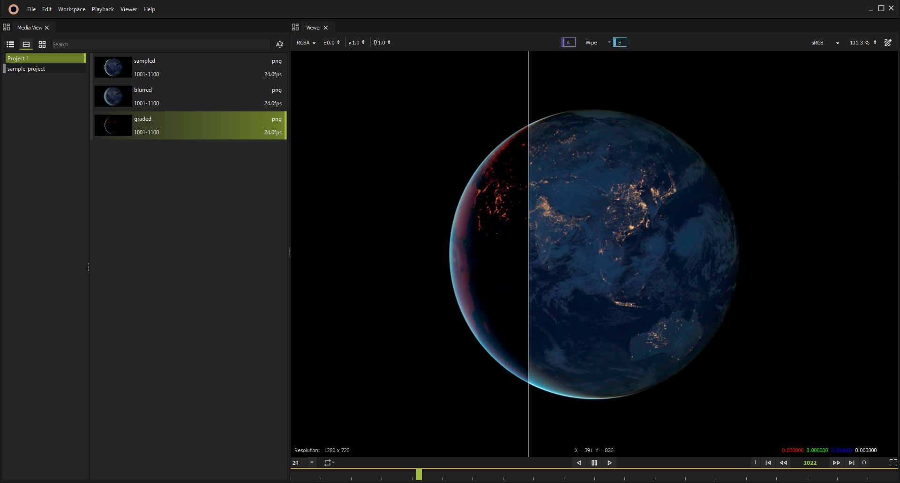](../images/VoidWipeCompare.png)

[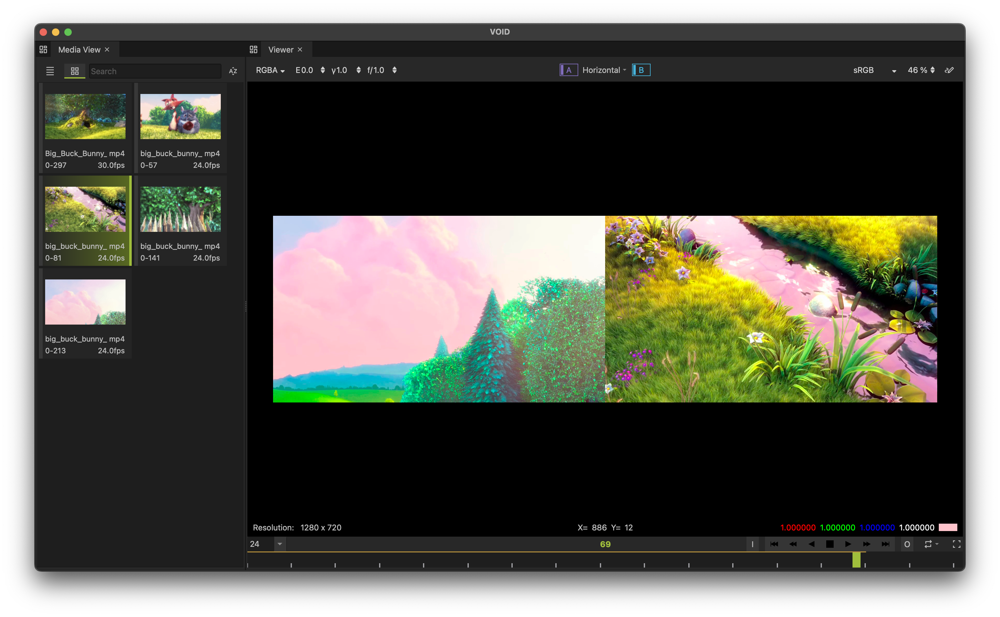](../images/VoidHorizontalCompare.png)

---

## Annotation Support

- Add annotations directly on media for review and feedback
- Useful for collaborative workflows and visual notes

> *Annotation export is not yet implemented. Exporting annotated frames will be supported once the media writer system is integrated.*

[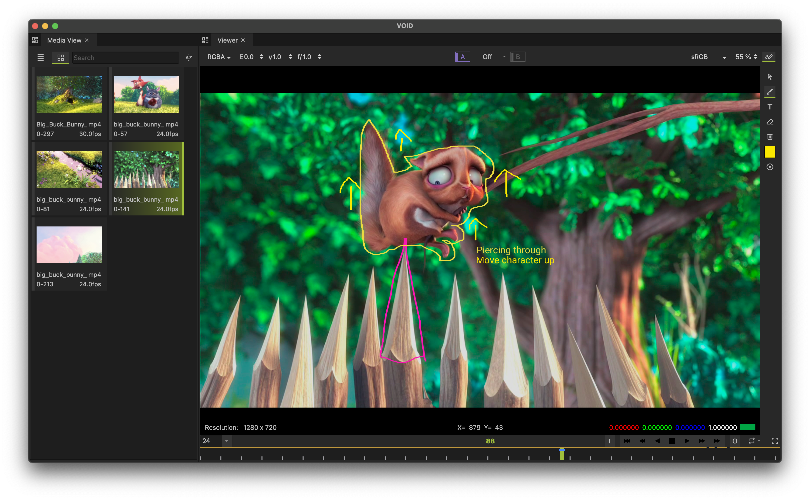](../images/VoidAnnotations.png)

---

## Configuration Options

Customize player behavior with basic preferences:

- Default media view interface
- Customization of the color scheme
- Handling of missing frames
- Undo history settings

[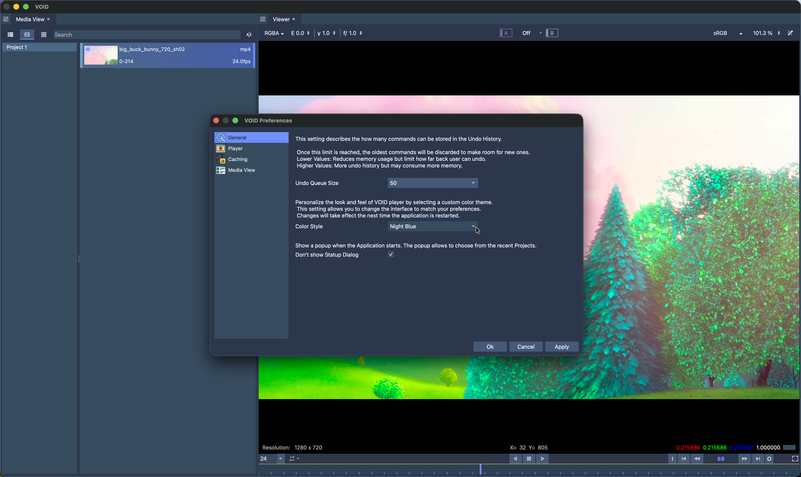](../images/VoidPreferences.png)

### Color Styles

| [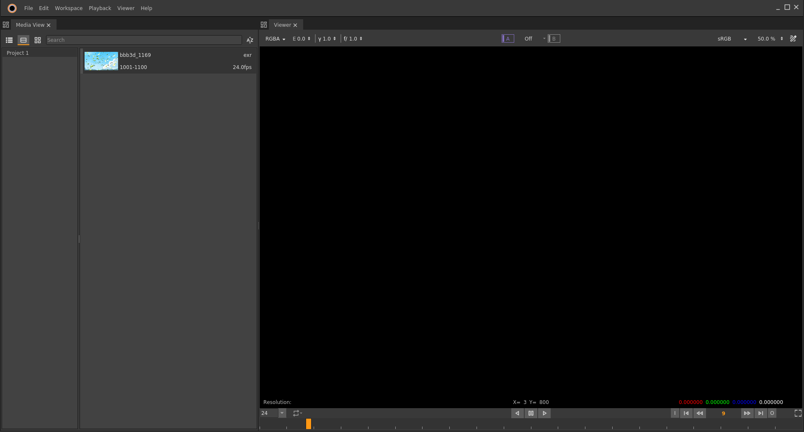](../images/VoidTheme-1.png) | [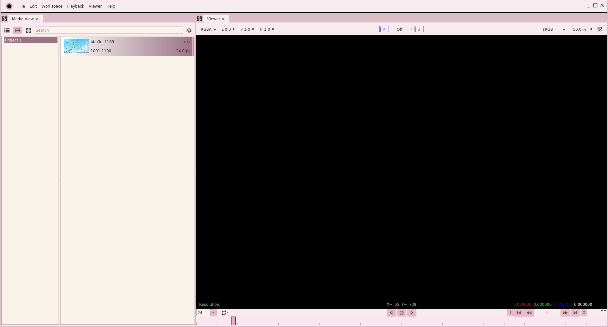](../images/VoidTheme-2.png) |
|---------------------------------------------------------------------------------|---------------------------------------------------------------------------------|
| [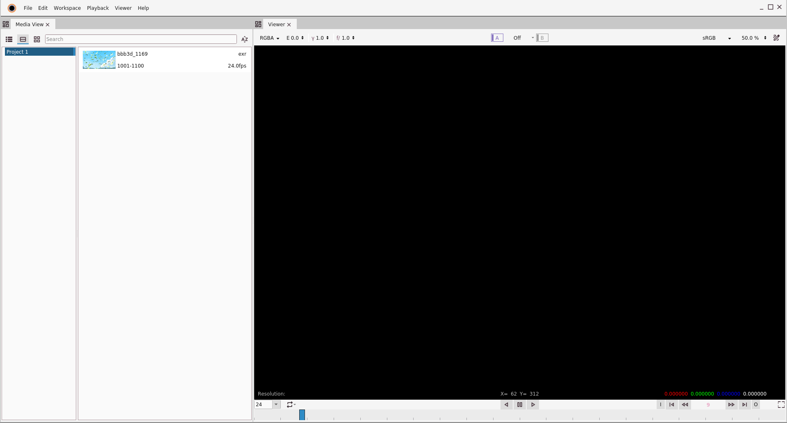](../images/VoidTheme-3.png) | [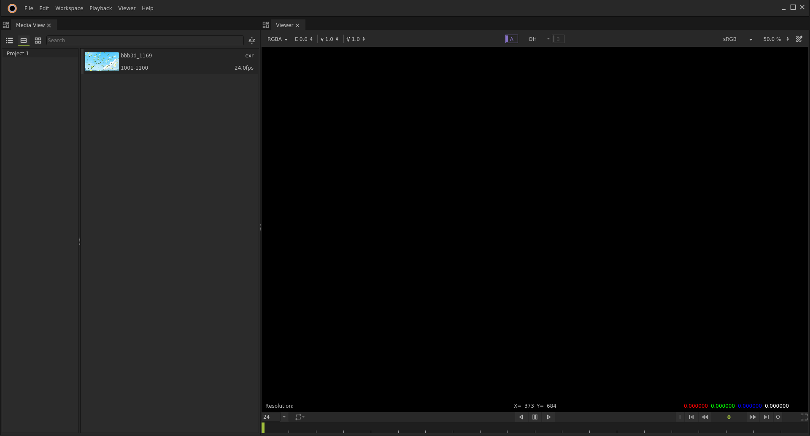](../images/VoidTheme-4.png) |

## Scripting

Support for scripting on the player using python bindings.

VOID provides internal API via **vortex** python binding, allowing interaction with internal components of the system

[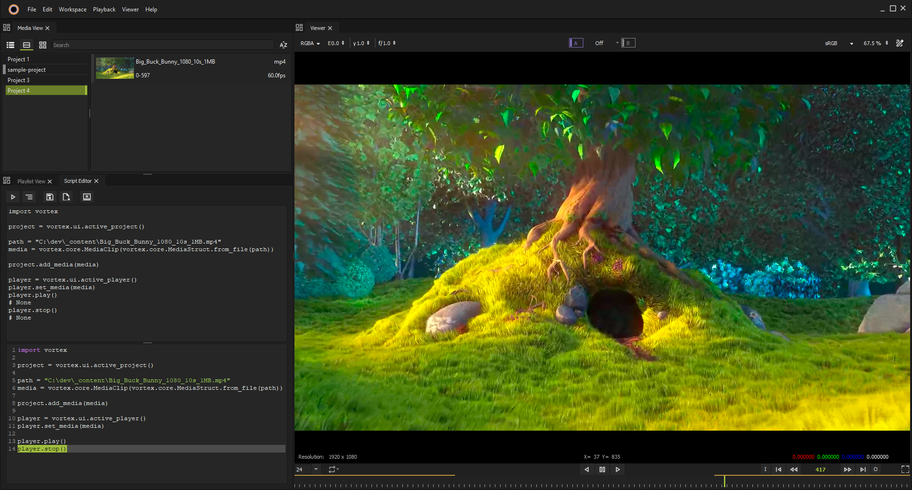](../images/VoidScriptEditor.png)

---

## Credits & Licensing Notice

Screenshots used in this project feature content from the open movie **Big Buck Bunny**, created by the [Blender Foundation](https://www.blender.org/).
This content is licensed under the [Creative Commons Attribution 3.0 license](https://creativecommons.org/licenses/by/3.0/).

> © Blender Foundation | [www.bigbuckbunny.org](https://peach.blender.org/)
